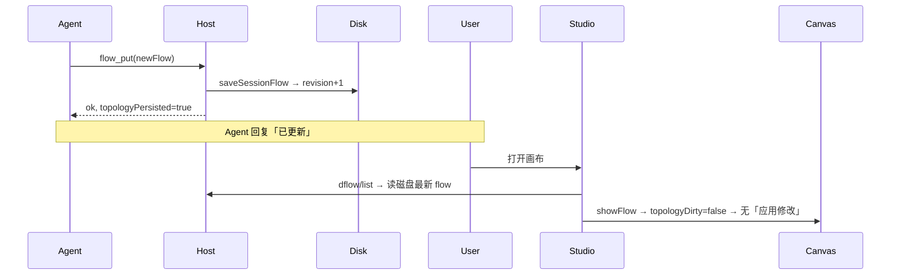
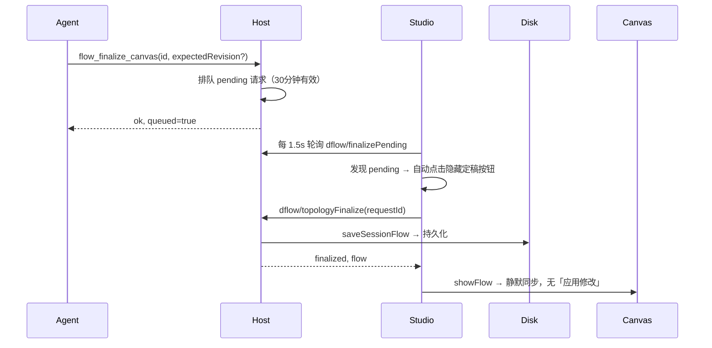

# DeepSeek Flow 中文使用说明 + 教程

> 版本：0.4.2
> 一句话：装好插件，对 Agent 说「构建工作流」，流程就变成一张可画、可写、可同步的图，重启电脑后下拉也不为空。

---

## 一、快速开始（3 步教程）

### 第 1 步：安装

```bash
# 在线安装
dsh plugin --profile web add "github:kanghelyu/dsh-deepseek-flow#main"

# 如果无法访问 GitHub（离线环境）：
dsh plugin --profile web add "file:/path/to/dsh-deepseek-flow-0.4.2.tar.gz"
```

### 第 2 步：重启 dsh web

```bash
pkill dsh && dsh web
# ⚠ 必须完全 kill + 重新 start，仅刷新浏览器不够
# 验证：curl -X POST http://127.0.0.1:3080/api/dflow/allFlows -H 'Content-Type: application/json' -d '{"args":{}}'
# 应返回 200
```

### 第 3 步：创建你的第一个工作流

打开浏览器 → `http://127.0.0.1:3080` → 新建一个 Session → 在聊天里输入：

> **「构建一个找论文、读论文、出综述的工作流」**

Agent 会自动调用 `flow_create`，完成：

1. 生成 `WORKFLOW.md`（总控文档）
2. 每步生成一个 `STEP.md` 独立工作区
3. 画布上画出节点和连线

然后点击顶部 **DeepSeek Flow** 标签，即可看到完整的流程图。

---

## 二、画布操作教程

### 节点操作

| 操作 | 方法 |
|------|------|
| **添加节点** | 底部工具栏：输入 / Agent / Map Agent / 条件 / 合并 / 输出 |
| **连接节点** | 从节点右侧圆点拖到目标节点（整个节点框都是释放区） |
| **移动节点** | 拖拽节点 — **只算布局，不算拓扑修改**，松手自动保存 |
| **删除节点** | 选中节点按 Delete，或底部 X 按钮 |
| **撤销 / 重做** | Ctrl/Cmd+Z / Shift+Ctrl/Cmd+Z |

### 画布导航

| 操作 | 方法 |
|------|------|
| **平移** | 拖拽空白区域 |
| **缩放** | Ctrl/Cmd + 滚轮，或触控板双指捏合 |
| **适配全图** | 工具栏「显示全图」按钮 |
| **调整面板宽度** | 拖拽左右分隔条；双击收起/展开 |
| **调整助手高度** | 拖拽底部助手分隔条 |

### 条件框（逻辑门）

添加「条件」节点时，选择 8 种门类型之一：

| 门类型 | 入边 | 出边行为 |
|--------|------|----------|
| **IF/ELSE** | 恰好 1 条 | 最多 1 条「是」+ 1 条「否」出线 |
| **AND / OR / NAND / NOR / XOR / XNOR** | 至少 2 条 | 可连多个目标，自动标注 |
| **NOT** | 恰好 1 条 | 恰好 1 条出线 |

> ⚠ 谓词只能写 `truthy`、`falsy`、`nonEmpty`，不能写自然语言条件句。
> 需要语义判断时，让上游 Agent 输出 JSON Boolean，再用 `predicate: "truthy"` 连接。

---

## 三、工作流切换教程

### 下拉菜单在哪

在 Studio 顶部工具栏，有一个标着工作流名称的下拉选择器。

### 下拉里有什么

- **当前 Session** 的工作流（最前）
- **其他 Session** 的历史工作流（中间）
- **共享模板**（最后）

### 切换会发生什么

1. 选其他 Session 的工作流 → 自动复制为当前 Session 的**独立副本**（文档工作区完全隔离）
2. 选共享模板 → 同样复制独立副本，不污染原件
3. 每次切换自动保存 `activeFlowId` → 重新打开 Studio 自动回到该工作流
4. **下拉列表直接从磁盘读取** → 重启 dsh web / 重启电脑后不会为空

### Agent 切换通知

切换工作流后，Agent 下次调用 `flow_list` / `flow_read` 会收到一次性 `activeFlowNotice`：

- 如果用户此前要求运行旧工作流 → Agent 改用新工作流，忽略旧指令
- 如果工作流没变 → 什么都不说，对话完全连续

---

## 四、AI 拓扑修改（隐形定稿机制）

### 场景 A：Agent 用 `flow_put` 修改拓扑（推荐）



> `flow_put` 本身已经持久化拓扑，画布不会弹「应用修改」。

### 场景 B：Agent 直接改文件 → `flow_finalize_canvas`



### 场景 C：Agent 忘记调 `flow_finalize_canvas`（兜底）

Studio 检测到：
- 磁盘上的拓扑与画布当前拓扑**不同**
- 画布**没有被用户手工编辑过**

→ 自动触发隐藏定稿（同场景 B）。

---

## 五、文件说明（双语文档）

| 文件 | 语言 | 说明 |
|------|------|------|
| `README.md` | English | 项目简介、安装、用法 |
| `README.zh-CN.md` | 中文 | 项目简介、安装、用法 |
| `DEEPSEEKFLOW-GUIDE.md` | English | 完整使用指南 + 教程 |
| `DEEPSEEKFLOW-使用说明.md` | 中文 | 完整使用指南 + 教程（本文） |
| `skills/deepseek-flow/SKILL.md` | English | Agent Skill 提示词 |
| `CHANGELOG.md` | English | 版本变更日志 |

---

## 六、常见排错

| 现象 | 原因 | 解决 |
|------|------|------|
| 下拉菜单为空 | dsh web 未重启，allFlows endpoint 404 | `pkill dsh && dsh web` 完全重启 |
| `/api/dflow/allFlows` 返回 404 | Typert 路由表在进程启动时冻结，新增端点未注册 | 完全重启 dsh web，仅刷新浏览器不够 |
| Agent 调工具返回 `unknown tool ''`（空名称） | dsh host 工具解析 bug | 更新 dsh 版本，或换用 `flow_put` 绕过 |
| 画布弹「应用修改」但 AI 已改过拓扑 | Agent 的工具调用失败（见上），磁盘拓扑未变；按钮对应的是**用户自己的**画布编辑 | 确认 `flow_put` 返回 `ok=true, topologyPersisted=true` |
| 节点位置变了但没改拓扑 | 位置是布局信息，不算拓扑修改 | 正常行为，松手自动保存 |
| 删除工作流后想恢复 | 插件托管文档移入 `deepseek-flow/trash/` | 从 trash 复制回 `workspaces/`，再用 `flow_put` 导入 |
| 共享模板被污染 | 0.4.2 前可能共享 docRoot | 升级到 0.4.2，切换时自动复制独立副本 |
| AI 助手/优化提示「provider 不可用」 | Session 未配置可用模型 | 在 Session 或助手菜单选择模型 |

---

## 七、维护

```bash
# 依赖自愈（旧环境兜底）
bash scripts/ensure-deps.sh

# 卸载
dsh plugin --profile web remove deepseek-flow

# 重新构建客户端（改过 src/client 后）
npm run build
```

---

MIT · 社区项目，与 DeepSeek 无关