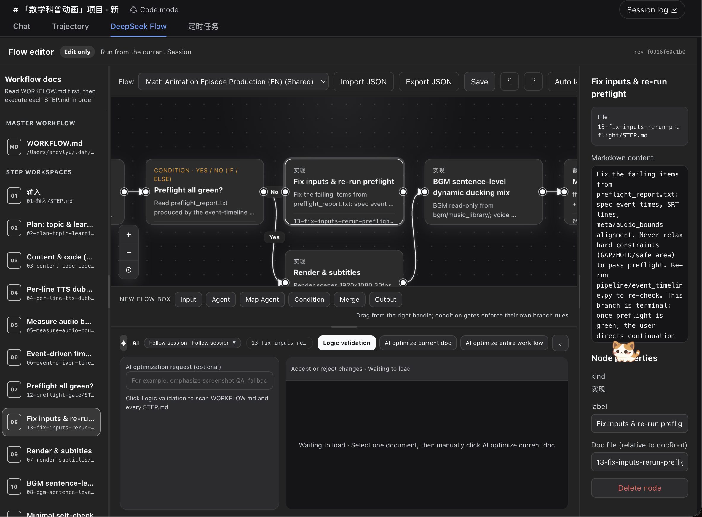
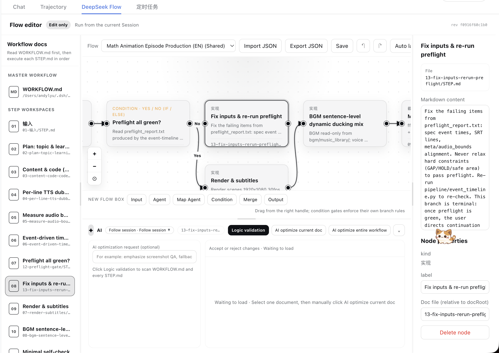

<h1 align="center">DeepSeek Flow</h1>

<p align="center"><strong>See the workflow. Review the topology. Keep the canvas and Markdown in sync.</strong></p>

<p align="center">A visual, Markdown-first workflow editor built for the DeepSeek Harness Web UI.</p>

<p align="center"><a href="https://deepseekflow.kanghelyu.org/">🌐 Official website — deepseekflow.kanghelyu.org</a></p>

<p align="center">
  <a href="https://www.npmjs.com/package/deepseek-flow"></a>
  <a href="https://github.com/kanghelyu/dsh-deepseek-flow/releases"></a>
  <a href="https://github.com/deepseek-ai/deepseek-harness"></a>
  <a href="LICENSE"></a>
</p>

<p align="center"><strong>English</strong> · <a href="README.zh-CN.md">简体中文</a></p>

DeepSeek Flow turns a `WORKFLOW.md` and its step-level `STEP.md` files into an editable diagram inside DeepSeek Harness. The diagram and the Markdown stay synchronized, so you can work visually without giving up portable, reviewable files.

It is intentionally an editor—not a workflow runtime. DeepSeek Flow helps you design, inspect, and improve a workflow; execution remains in the current Session.

<p align="center">
  
  
</p>

## What it gives you

- **Markdown as the source of truth** — one master `WORKFLOW.md`, plus one `STEP.md` workspace for each step.
- **A real visual editor** — create, move, connect, reconnect, label, and delete nodes and arrows.
- **Two-way synchronization** — edits made on the canvas and in the Markdown editor are written back to the workflow files.
- **Reviewed topology transactions** — structural edits remain a draft until the current Session Agent reviews and accepts the complete graph.
- **Executable gate semantics** — the exported contract includes formulas, operands, predicates, and deterministic Boolean results without running Agent steps.
- **Per-session isolation** — each Harness session keeps its own workflows, with optional shared templates.
- **Comfortable large-flow navigation** — collapsible and resizable side panels, pan and zoom, fit-to-view, animated node focus, and independent scrolling regions.
- **Native theme support** — the interface follows Harness light and dark themes and the active WebUI language.
- **Manual AI assistance** — run logic validation, optimize one document with review, or optimize the complete workflow.
- **Background AI jobs** — switching documents, views, or sessions does not interrupt accepted jobs; document proposals are restored when you return.

## Quick start

Install from GitHub into the Web profile:

```bash
dsh plugin --profile web add "github:kanghelyu/dsh-deepseek-flow#main"
```

Restart `dsh web`, open a session, and select the **DeepSeek Flow** tab.

To confirm that the plugin is mounted:

```bash
dsh web --dump-config | grep deepseek-flow
```

## Your first workflow

1. In a Session, ask the Agent to **build a workflow** or **import a workflow**.
2. Open **DeepSeek Flow**. The plugin scaffolds a master document, step documents, and their visual layout.
3. Select a document to edit its Markdown, or drag a node's output handle onto another node to create an arrow.
4. For node or arrow changes, click **Apply changes**. DeepSeek Flow validates the graph, asks the current Session Agent to review it, validates the result again, and saves one new revision.
5. Markdown edits continue to auto-save independently of topology changes.
6. Return to the Session when you want the Agent to execute the workflow.

A typical workflow directory looks like this:

```text
my-workflow/
├── WORKFLOW.md
├── flow.json
└── steps/
    ├── research/
    │   └── STEP.md
    ├── draft/
    │   └── STEP.md
    └── quality-check/
        └── STEP.md
```

## Logic gates

Condition boxes support eight gate types: **IF/ELSE, AND, OR, NOT, NAND, NOR, XOR, and XNOR**. Gate metadata controls connection labels, outgoing limits, and the Boolean contract exported to the current Session.

| Gate | Connection behavior | Boolean result |
| --- | --- | --- |
| **IF / ELSE** | One **Yes** and one **No** branch at most. | Selects exactly the branch matching the condition result. |
| **AND / NAND** | Multiple distinct targets; labels are automatic. | Evaluates all known operands, with NAND negating AND. |
| **OR / NOR** | Multiple distinct targets; labels are automatic. | Evaluates all known operands, with NOR negating OR. |
| **XOR / XNOR** | Multiple distinct targets; labels are automatic. | Evaluates parity, with XNOR negating XOR. |
| **NOT** | Exactly one automatically labeled outgoing arrow. | Negates its single input. |

Duplicate targets, duplicate Yes/No branches, excess IF/ELSE or NOT arrows, invalid aggregate input arity, cycles, and unknown box kinds are rejected with actionable validation messages. Legacy true/false branches are normalized to IF/ELSE.

The `flow_evaluate` tool can deterministically evaluate gate state and activated targets from upstream step results. It does not run Agent steps or perform workflow side effects.

## Reviewed topology transactions

Adding or deleting boxes, gates, arrows, inputs, or outputs creates a **local topology draft**. Persisting it is an explicit transaction:

```text
Local validation → current Session Agent review → second validation → atomic revision save
```

- The reviewer is the live current Session Agent, not a detached background session.
- Markdown is immutable review context: topology review cannot silently rewrite document content.
- Stale or incomplete revisions are rejected so concurrent writers cannot lose state.
- Moving a box changes layout only and auto-saves without opening a topology transaction.
- While a topology draft is pending, logic validation and whole-workflow optimization stay disabled; single-document editing and optimization remain available.
- Deleted managed workflows and generated step directories move to trash; external custom document roots are never moved automatically.

## AI document assistant

Every AI action is started manually. DeepSeek Flow never runs validation or optimization behind your back.

| Action | Scope | What happens before files change |
| --- | --- | --- |
| **Logic validation** | All workflow documents and arrow relationships | The Agent returns clickable errors and warnings; no file is changed. |
| **Optimize current document** | The selected `WORKFLOW.md` or `STEP.md` only | A complete proposal appears in the preview. You must **Accept** or **Reject** it. |
| **Optimize entire workflow** | `WORKFLOW.md` and every `STEP.md` | A warning is shown first. After confirmation, the Agent rewrites and saves the complete set directly. There is no per-document review or built-in undo. |

For whole-workflow optimization, commit or back up important Markdown files first. If a document changes while an optimization is running, DeepSeek Flow refuses to overwrite the newer content.

The assistant uses an isolated Agent job and does not run the workflow. Model and reasoning-effort controls are available in the assistant menu.

Topology review is the exception: it deliberately uses the live current Session Agent because that Session owns the workflow context. Document validation and optimization continue to use isolated one-shot Agent jobs.

## Design boundaries

DeepSeek Flow deliberately does **not** provide:

- a workflow execution button or runtime;
- API-key, provider, or credential management;
- triggers, schedules, webhooks, or execution history;
- a replacement for normal Session interaction.

That boundary keeps the plugin focused: edit and validate in DeepSeek Flow, execute in the Session.

## Local development

Clone the repository and link it into your Web profile:

```bash
git clone https://github.com/kanghelyu/dsh-deepseek-flow.git
cd dsh-deepseek-flow
dsh plugin --profile web add "link:$PWD"
```

Useful checks:

```bash
npm test
npm run build
npm run smoke
```

If an older local Harness installation is missing linked dependencies, stop `dsh web` before running:

```bash
bash scripts/ensure-deps.sh
```

After changing client code, rebuild and hard-refresh the browser. Host changes require restarting `dsh web`.

<details>
<summary>Repository layout</summary>

```text
deepseek-flow/
├── lib/                 Host code, topology transactions, gate semantics, and client bundle
├── src/client/          WebUI client source
├── scripts/             Build, dependency, screenshot, and smoke checks
├── test/                Contract and regression tests
├── examples/            Example Markdown workflow
└── docs/images/         README screenshots
```

</details>

Quality safeguards include 75 automated contract and behavior tests covering graph conversion, revision locking, document lifecycle, topology review, Boolean semantics, connection validation, Agent jobs, and the generated client bundle. See [Code quality notes](CODE-QUALITY.md) and [QA report](QA-REPORT.md) for more detail.

## Troubleshooting

- **The tab does not appear:** verify the plugin with `dsh web --dump-config`, then restart the Web profile.
- **The UI looks stale:** rebuild with `npm run build`, restart when Host code changed, and hard-refresh the browser.
- **AI actions report no provider:** select a working model in the Session or in the assistant menu.
- **Whole-workflow optimization is rejected:** one or more documents changed while the Agent was working, or the Agent did not return every required document. Retry from the latest files.
- **Apply changes is rejected:** fix the reported cycle, missing input, branch limit, or stale revision, then submit the complete topology again.

## Uninstall

```bash
dsh plugin --profile web remove deepseek-flow
```

## License

[MIT](LICENSE). Community project; not affiliated with DeepSeek.
