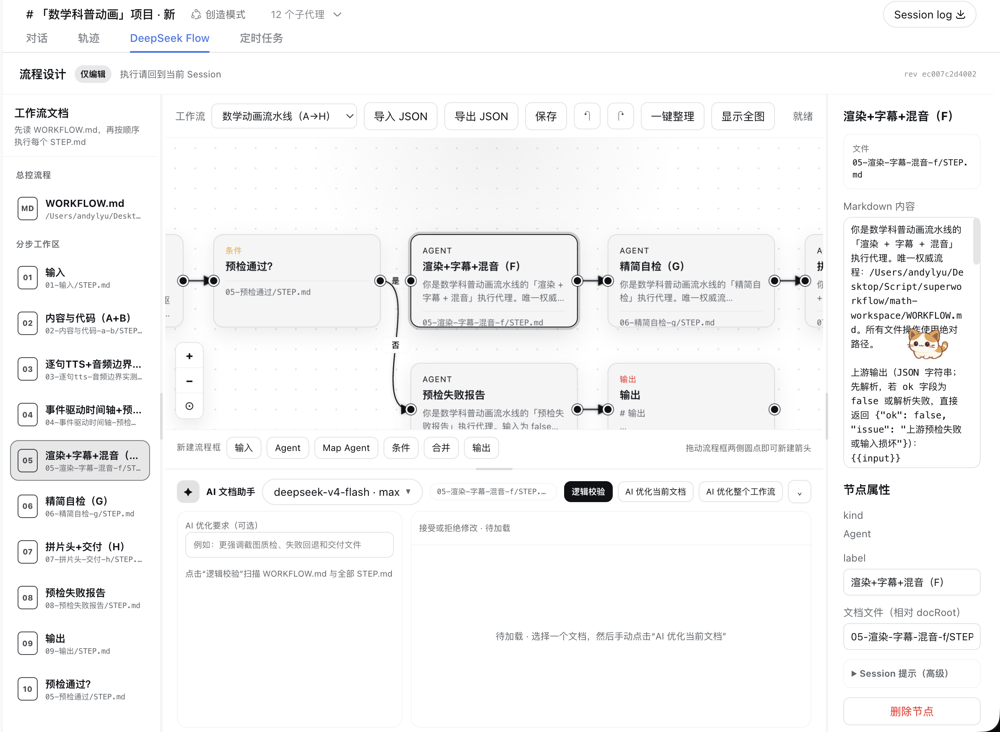
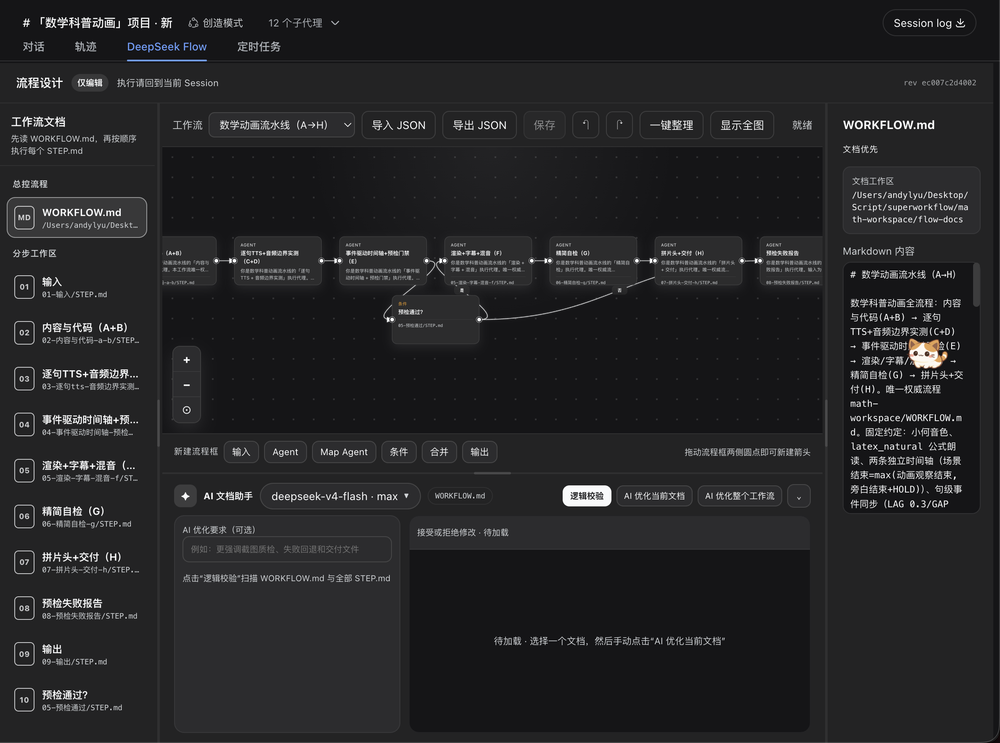

# DeepSeek Flow

> 把「工作流」变成每个会话里的一张**能画、能写、能同步的图**。

<details open>
<summary><b>🇨🇳 中文</b>（点击切换 English）</summary>

<br>

## 先讲人话

**DeepSeek Flow 是一个装在 [DeepSeek Harness](https://github.com/deepseek-ai/DeepSeek-Harness) 里的可视化工作流插件。**

你在 Codex / Claude 里见过的那种「WORKFLOW.md + 每一步一个 STEP.md」的工作流，它能把它们变成**一张流程图**：左边是文档目录，中间是画布，右边是 Markdown 编辑器，底部是 AI 助手。

### 它跟别的「flow 工具」有什么不同

| 别人 | DeepSeek Flow |
| --- | --- |
| 全局共享一套流程，换会话就串味 | **每个 session 一个独立工作流**，互不干扰 |
| 流程图和文档各写各的，改完就分叉 | **画布 ↔ WORKFLOW.md/STEP.md 双向同步**：改图 = 改文档，改文档 = 刷新图 |
| 建流程要先学怎么画 | 对 Agent 说一句「导入工作流」，它自动生成总纲 + 每步文档 + 画布 |
| 跑分、评测、Bench 一堆用不上的 | 只做三件事：**编辑流程、同步文档、AI 校验/优化**，砍光冗余 |
| 画布库越用越重 | **自研原生 SVG 边层 + HTML 节点层**，不依赖 @xyflow，bundle 仅 ~120KB |
| 颜色写死，和你的界面打架 | 全部使用 Harness 主题 token，**明暗主题自动跟随 WebUI** |

### 适合谁

- 用 Agent 跑多步骤生产流程的人（视频流水线、写作、质检……）：流程沉淀成图，下期直接复用
- 想「看得见」自己工作流的人：每一步一个节点、一个文档、一个工作区
- 想让 AI 帮你改流程的人：内置逻辑校验 + 单文档/整流程 AI 优化（**接受/拒绝制**，不改不落盘）

### 平台说明

目前只针对 **Web UI** 做过界面优化；Host 侧逻辑与界面无关，TUI 等其他界面应该也能用，但未专门适配——欢迎 PR。

### 效果图（明暗跟随你的 WebUI 主题）

<p align="center">
  
  
</p>

> 两图是同一份工作流、同一个版本——只切换了 WebUI 的主题，插件颜色自动跟随。

---

## 部署（一条命令）

```bash
dsh plugin --profile web add "github:kanghelyu/dsh-deepseek-flow#main"
# 然后重启 dsh web 即可（bundle 插件重启生效）
```

**真的就是一条命令**：纯 git 源安装、构建产物已入库、依赖全部来自 registry、bundle 层（cordis.patch）随安装自动挂载——已在全新 profile 实测验证（安装 19 秒、Host/Typert 加载通过、组合树自动注册，无需改任何配置）。

安装后验证：

```bash
dsh web --dump-config | grep deepseek-flow   # 组合树应包含 deepseek-flow 行
```

本地开发用 `dsh plugin --profile web add link:/path/to/deepseek-flow`。

> 卸载：`dsh plugin --profile web remove deepseek-flow`。若你的环境曾手工修改过 patch 层（如早期版本的手动 insert 行），删除对应行即可。
> 依赖兜底：如果极老环境（自带残缺 node_modules）出现 `@deepseek-ai/*` 解析失败，运行仓库内 `bash scripts/ensure-deps.sh` 即可自愈。

### 使用速览

1. 打开任意会话 → 顶部标签 **DeepSeek Flow**
2. 直接说「导入工作流 / 生成工作流」→ Agent 用 `flow_create` 生成总纲 + 每步 STEP.md + 画布
3. 画布里拖节点、连箭头、点节点改提示词 → 保存自动写回对应 MD 文件
4. 底部 **AI 文档助手**：逻辑校验 / 单文档优化 / 整流程优化（模型与思考强度可自选，跟随会话默认）
5. 所有 AI 任务跑在**独立会话**里：切走、切会话都不中断，回来结果还在

---

## 专业部分（不是人话）

### 架构

```
deepseek-flow/                    ← bundle 插件（dsh.bundle.patch + dsh.client）
├── lib/index.js                  Host：per-session 存储、remote CRUD、工具、assist 编排
├── lib/agent-assistant.js        AI 校验/优化：提示词、schema、独立会话任务
├── lib/typert.descriptors.js     Typert wire 参数白名单
├── lib/client.js                 Client bundle（构建产物，已入库）
├── src/client/entry.js           Client 源码：五列布局 + 自研画布 + 助手
├── scripts/                      build / ensure-deps / ui-shot(Playwright 断言) / smoke
├── test/                         31 项契约测试（node --test）
└── cordis.patch.yml              插件行（dataDir、可选 assistantModel / assistantTimeoutMs）
```

### 关键机制

- **存储**：`~/.dsh/deepseek-flow/shared.json`（共享模板）+ `sessions/<sessionId>.json`（每会话 flows + flowRuns），文件是权威
- **文档驱动**：`flow.workflowDoc` + `flow.docs`（nodeId → STEP.md 相对路径）；读取时文件覆盖节点 prompt，保存时写回
- **会话隔离**：工具用 `exec.agent.id ?? agent.session?.id`；列表 = 本会话 + 共享模板（同名去重、会话版优先）
- **AI 任务**：`dflow/assist` 受理即返回（fire-and-forget），任务在 `agents.create` 的**独立会话**执行（`meta: { agentPreset: "standard", cwd }`，cwd 必传否则子代理静默失败）；结果按 `sessionId:requestId` 暂存（TTL 30min），Client 每 3s 轮询 `dflow/assistHistory`，卸载/切视图不中断
- **模型路由**：`agentDefaultModel.currentSelection()` 跟随会话；`assistantModel` 配置或 UI 选择可覆盖；`reasoningEffort` 支持 off/high/max
- **防回归基线**：箭头 `fill:none!important` + 闭合 marker；`GRAPH_MIN_ZOOM = 0.5`；画布结构 CSS 只增不删；颜色只用 `--dsw-alias-*` token

### 构建与测试

```bash
node --check lib/index.js lib/agent-assistant.js src/client/entry.js
node --test test/*.test.mjs          # 31/31
node scripts/build.mjs               # 重建 lib/client.js（+ rev）
node scripts/ui-shot.mjs             # Playwright 截图 + 边/箭头/布局断言
bash scripts/ensure-deps.sh          # 依赖自愈（私有包链接全局 DSH）
```

### 红线

- 不设默认超时（`assistantTimeoutMs: null`，模型自然完成；显式配置仍生效）
- 不恢复运行按钮 / worker / 凭证（执行始终留在 Session）
- 删除文件一律 `/usr/bin/trash`；不动其他插件与 Obsidian 数据

</details>

<details>
<summary><b>🇺🇸 English</b>（Click to switch to 中文）</summary>

<br>

## Plain English first

**DeepSeek Flow is a visual-workflow plugin for [DeepSeek Harness](https://github.com/deepseek-ai/DeepSeek-Harness).**

It turns the "WORKFLOW.md + one STEP.md per step" pattern you know from Codex / Claude into **a living diagram**: document rail on the left, canvas in the middle, Markdown editor on the right, AI assistant at the bottom.

### What makes it different

| Other flow tools | DeepSeek Flow |
| --- | --- |
| One global workflow shared by everyone | **One isolated workflow per session** |
| Diagram and docs drift apart | **Canvas ↔ WORKFLOW.md/STEP.md two-way sync** |
| You have to draw everything by hand | Tell the Agent "import a workflow" — it scaffolds the docs and the canvas |
| Benchmarks and bloat you never use | Only three jobs: **edit flows, sync docs, AI review/optimize** |
| Heavy third-party canvas libs | **Hand-rolled SVG edge layer + HTML node layer**, no @xyflow, ~120KB bundle |
| Hard-coded colors that clash | Harness theme tokens — **automatically follows your WebUI light/dark theme** |

### Who it is for

- Anyone running multi-step production flows with Agents (video pipelines, writing, QA…): freeze the flow into a diagram and reuse it every episode
- Anyone who wants to *see* their workflow: one node, one document, one workspace per step
- Anyone who wants AI to improve their flow: built-in logic validation and single-doc / whole-flow optimization with **explicit accept/reject** (nothing is written until you accept)

### Platform note

The UI is currently optimized for **Web UI**. The Host logic is UI-agnostic, so other UIs (TUI etc.) should work, but are not specially adapted — PRs welcome.

### Screenshots (follows your WebUI theme)

<p align="center">
  
  
</p>

> Same flow, same build — only the WebUI theme was toggled; plugin colors follow automatically.

---

## Deploy (one command)

```bash
dsh plugin --profile web add "github:kanghelyu/dsh-deepseek-flow#main"
# then restart dsh web (bundle plugins activate on restart)
```

**Really just one command**: pure git source, build artifacts committed, dependencies all from the registry, and the bundle layer (cordis.patch) mounts automatically with the install — verified on a fresh profile (19s install, Host/Typert load OK, composition tree auto-registered, zero manual config).

Verify after install:

```bash
dsh web --dump-config | grep deepseek-flow   # the tree should contain the deepseek-flow row
```

Local development: `dsh plugin --profile web add link:/path/to/deepseek-flow`.

> Uninstall: `dsh plugin --profile web remove deepseek-flow`. If your environment was ever hand-patched (e.g. manual insert rows from early versions), remove that row as well.
> Dependency fallback: if a very old environment (with a broken node_modules) fails to resolve `@deepseek-ai/*`, run `bash scripts/ensure-deps.sh` from the repo.

### Quick usage

1. Open any session → **DeepSeek Flow** tab
2. Say "import workflow" — the Agent uses `flow_create` to scaffold WORKFLOW.md + per-step STEP.md + canvas
3. Drag nodes, draw arrows, edit prompts in the canvas → saving writes back to the MD files
4. Bottom **AI doc assistant**: logic validation / single-doc optimize / whole-flow optimize (model & reasoning effort selectable; follows session by default)
5. All AI jobs run in an **isolated session**: switching views or sessions never interrupts them; results are there when you come back

---

## The professional part (not plain English)

### Architecture

```
deepseek-flow/                    ← bundle plugin (dsh.bundle.patch + dsh.client)
├── lib/index.js                  Host: per-session storage, remote CRUD, tools, assist orchestration
├── lib/agent-assistant.js        AI review/optimize: prompts, schemas, isolated-session jobs
├── lib/typert.descriptors.js     Typert wire parameter whitelist
├── lib/client.js                 Client bundle (build artifact, committed)
├── src/client/entry.js           Client source: five-column layout + hand-rolled canvas + assistant
├── scripts/                      build / ensure-deps / ui-shot (Playwright assertions) / smoke
├── test/                         31 contract tests (node --test)
└── cordis.patch.yml              plugin row (dataDir, optional assistantModel / assistantTimeoutMs)
```

### Key mechanics

- **Storage**: `~/.dsh/deepseek-flow/shared.json` (shared templates) + `sessions/<sessionId>.json` (per-session flows + flowRuns); files are the source of truth
- **Doc-driven**: `flow.workflowDoc` + `flow.docs` (nodeId → relative STEP.md); reading overlays file content onto node prompts, saving writes back
- **Session isolation**: tools read `exec.agent.id ?? agent.session?.id`; list = own session + shared (dedup, session copy wins)
- **AI jobs**: `dflow/assist` returns on acceptance (fire-and-forget); work runs in an **isolated session** via `agents.create` (`meta: { agentPreset: "standard", cwd }` — cwd is REQUIRED or the subagent fails silently); results cached by `sessionId:requestId` (TTL 30 min); Client polls `dflow/assistHistory` every 3 s; unmount/view-switch never interrupts
- **Model routing**: follows `agentDefaultModel.currentSelection()`; overridable via `assistantModel` config or the UI; `reasoningEffort` supports off/high/max
- **Regression baselines**: arrows `fill:none!important` + closed marker; `GRAPH_MIN_ZOOM = 0.5`; canvas structural CSS is append-only; colors use `--dsw-alias-*` tokens only

### Build & test

```bash
node --check lib/index.js lib/agent-assistant.js src/client/entry.js
node --test test/*.test.mjs          # 31/31
node scripts/build.mjs               # rebuild lib/client.js (+ rev)
node scripts/ui-shot.mjs             # Playwright screenshot + edge/arrow/layout assertions
bash scripts/ensure-deps.sh          # dependency self-heal (private packages → global DSH)
```

### Hard rules

- No default timeout (`assistantTimeoutMs: null`; jobs finish naturally; an explicit config still applies)
- Never restore run buttons / workers / credentials (execution always stays in the Session)
- Delete files only via `/usr/bin/trash`; never touch other plugins or Obsidian data

</details>

---

MIT License · Community project, not affiliated with DeepSeek
